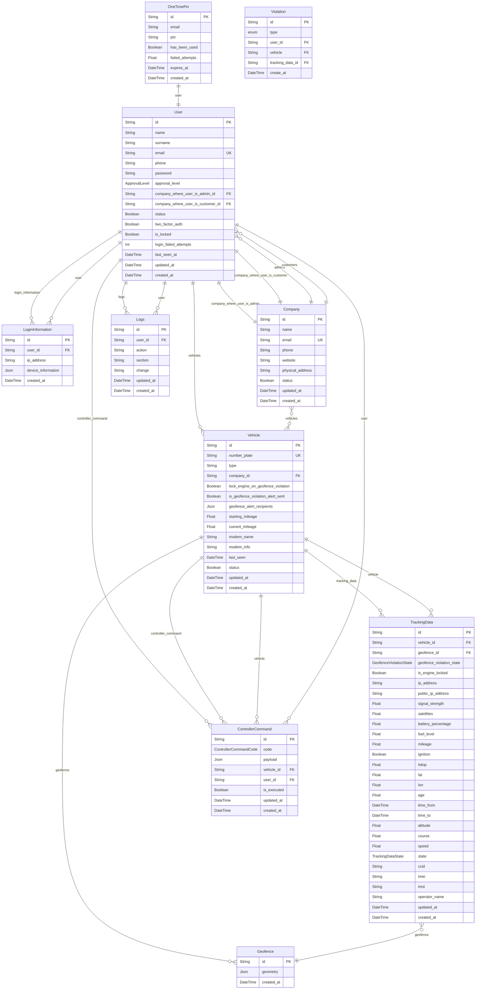

Design
====

## ERD

```mermaid
erDiagram

   User {
      String id PK
      String name
      String surname
      String email UK
      String phone
      String password
      ApprovalLevel approval_level
      String company_where_user_is_admin_id FK
      String company_where_user_is_customer_id FK
      Boolean status
      Boolean two_factor_auth
      Boolean is_locked
      Int login_failed_attempts
      DateTime last_seen_at
      DateTime updated_at
      DateTime created_at
   }
   
   OneTimePin {
      String id PK
      String email
      String pin
      Boolean has_been_used
      Float failed_attempts
      DateTime expires_at
      DateTime created_at
   }

   LoginInformation {
      String id PK
      String user_id FK
      String ip_address
      Json device_information
      DateTime created_at
   }

   Company {
      String id PK
      String name
      String email UK
      String phone
      String website
      String physical_address
      Boolean status
      DateTime updated_at
      DateTime created_at
   }

   Vehicle {
      String id PK
      String number_plate UK
      String type
      String company_id FK
      Boolean lock_engine_on_geofence_violation
      Boolean is_geofence_violation_alert_sent
      Json geofence_alert_recipients
      Float starting_mileage
      Float current_mileage
      String modem_name
      String modem_info
      DateTime last_seen
      Boolean status
      DateTime updated_at
      DateTime created_at
   }

   TrackingData {
      String id PK
      String vehicle_id FK
      String geofence_id FK
      GeofenceViolationState geofence_violation_state
      Boolean is_engine_locked
      String ip_address
      String public_ip_address
      Float signal_strength
      Float satellites
      Float battery_percentage
      Float fuel_level
      Float mileage
      Boolean ignition
      Float hdop
      Float lat
      Float lon
      Float age
      DateTime time_from
      DateTime time_to
      Float altitude
      Float course
      Float speed
      TrackingDataState state
      String ccid
      String imei
      String imsi
      String operator_name
      DateTime updated_at
      DateTime created_at
   }

   Geofence {
      String id PK
      Json geometry
      DateTime created_at
   }

   ControllerCommand {
      String id PK
      ControllerCommandCode code
      Json payload
      String vehicle_id FK
      String user_id FK
      Boolean is_executed
      DateTime updated_at
      DateTime created_at
   }

   Logs {
      String id PK
      String user_id FK
      String action
      String section
      String change
      DateTime updated_at
      DateTime created_at
   }

   Violation {
      String id PK
      enum type
      String user_id FK
      String vehicle FK
      String tracking_data_id FK
      DateTime create_at
   }

   User ||--o{ Vehicle: "vehicles"
   User ||--o{ ControllerCommand: "controller_command"
   User ||--o{ LoginInformation: "login_information"
   User ||--o{ Logs: "logs"
   User ||--|| Company: "company_where_user_is_admin"
   User ||--|| Company: "company_where_user_is_customer"
   OneTimePin ||--|| User: "user"
   LoginInformation }o--|| User: "user"
   Company ||--o{ User: "admins"
   Company ||--o{ User: "customers"
   Company }o--o{ Vehicle: "vehicles"
   Vehicle ||--o{ TrackingData: "tracking_data"
   Vehicle ||--o{ Geofence: "geofence"
   Vehicle ||--o{ ControllerCommand: "controller_command"
   TrackingData }o--|| Vehicle: "vehicle"
   TrackingData }o--|| Geofence: "geofence"
   ControllerCommand }o--|| Vehicle: "vehicle"
   ControllerCommand }o--|| User: "user"
   Logs }o--|| User: "user"
```